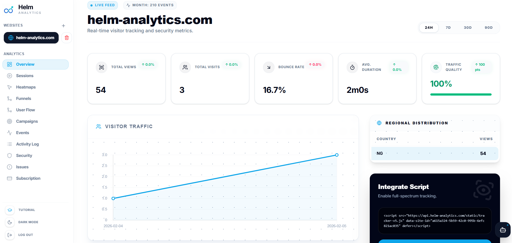

# Helm Analytics

<div align="center">
  
</div>

<div align="center">

**The High-Performance, Privacy-First Web Analytics Platform.**

[](LICENSE)
[](https://hub.docker.com/r/danielowenllm/helm-analytics-backend)
[](https://goreportcard.com/report/github.com/helm-analytics/helm-analytics)

[Live Demo](https://app.helm-analytics.com/demo) · [Documentation](https://docs.helm-analytics.com) · [Community](https://discord.gg/helm-analytics)

</div>

---

## 📖 Introduction

Helm Analytics is a self-hosted, open-source alternative to Google Analytics, designed for those who care about speed, privacy, and data ownership. 

Unlike traditional analytics tools that bloat your website with heavy scripts and sell your user data, Helm uses a **< 2KB lightweight tracker** and stores all data on your own infrastructure (or our private cloud). We utilize **ClickHouse** for sub-second query performance on massive datasets.

## 🚀 Why Helm? (Comparison)

| Feature | Helm Analytics | Google Analytics 4 | Plausible / Fathom |
| :--- | :--- | :--- | :--- |
| **Privacy Law Compliance** | ✅ GDPR/CCPA Ready | ❌ Complex / Grey Area | ✅ Yes |
| **Data Ownership** | ✅ 100% Yours | ❌ Google's Data | ✅ Yours |
| **Script Weight** | ⚡ **< 2 KB** | 🐢 ~45 KB | ~1 KB |
| **Cookies** | 🍪 **Cookie-Free** | 🍪 Heavy Usage | Cookie-Free |
| **Session Replay** | ✅ **Included** | ❌ No | ❌ No (Usually separate) |
| **Heatmaps** | ✅ **Included** | ❌ No | ❌ No |
| **Self-Hosted Option** | ✅ MIT License | ❌ No | ✅ / ❌ (Varies) |

---

## ✨ Key Features

### 📊 Core Analytics
- **Real-Time Traffic:** See visitors on your site *right now*.
- **Privacy-First Tracking:** Unique visitor counting without persistent cookies or IP logging.
- **Device & Geo Data:** Breakdown by Browser, OS, Country, and City.
- **UTM Campaign Tracking:** Automatic attribution for marketing campaigns.

### 🎭 Session Intelligence
- **Session Replay:** Watch high-fidelity replays of user sessions to understand behavior. 
  - *Privacy Note:* All inputs and text can be masked automatically.
- **Heatmaps:** Visualize Click and Scroll data to optimize landing pages.
- **Conversion Funnels:** Define multi-step paths and spot where users drop off.

### 🛡️ Security & Performance
- **Application WAF:** Built-in protection against XSS, SQLi, and path traversal attacks directly in the ingestion layer.
- **Rate Limiting:** Automatic IP-based rate limiting to prevent abuse.
- **Zero-Dependency Tracker:** No external requests, no ad-blocker triggers (when self-hosted).

---

## 🛠️ Architecture

Helm is designed for horizontal scalability and high throughput.

```mermaid
graph TD
    User[Visitor Browser] -->|HTTP POST /track| LoadBalancer
    LoadBalancer -->|Traffic| API[Ingestion API (Go)]
    API -->|Write (Batch)| ClickHouse[(ClickHouse DB)]
    API -->|Metadata| PostgreSQL[(PostgreSQL DB)]
    API -->|Read (Aggregates)| ClickHouse
    Admin[Dashboard User] -->|View Stats| API
```

- **Ingestion API (Go):** Handles thousands of requests per second with minimal CPU footprint.
- **Storage (ClickHouse):** Columnar database optimized for analytical queries (OLAP).
- **Metadata (PostgreSQL):** Stores user accounts, site configurations, and saved reports.
- **Frontend (React/Vite):** A fast Single Page Application (SPA) for the dashboard.

---

## ⚡ Quick Start (Community Edition)

The fastest way to run Helm Analytics in production is using our automated installation script.

### 1-Click Installer (Recommended)

Run this command on a fresh Ubuntu 20.04+ or Debian VPS. It will install Docker, pull the latest release, optionally configure automatic SSL via Caddy, and start the platform.

```bash
curl -sSL https://raw.githubusercontent.com/Helm-Analytics/sentinel-mvp/master/install.sh | bash
```

### Manual Installation (Advanced)

If you prefer to set up your own reverse proxy (like Nginx, Traefik, or Cloudflare Tunnels), you can run Helm manually using Docker Compose.

```bash
# Clone the repository
git clone https://github.com/Helm-Analytics/helm-analytics.git
cd helm-analytics

# Download the community compose file
curl -o docker-compose.community.yml https://raw.githubusercontent.com/Helm-Analytics/helm-analytics/main/docker-compose.community.yml

# Start the stack
docker-compose -f docker-compose.community.yml up -d
```

### 2. Access & Setup

1.  **With Installer SSL:** Open `https://your-domain.com`.
2.  **Without SSL/Local:** Open `http://<your-server-ip>:8012` (or `localhost:8012`).
3.  Register a new account (the first account created becomes the Admin).

### 3. Add Your Website

1.  Click **"Add Site"** in the dashboard.
2.  Enter your domain name (e.g., `example.com`).
3.  Copy the generated Tracking Snippet and paste it into the `<head>` of your website.

---

## 🔌 Integration Guide (SDKs)

Helm offers high-performance server-side SDKs to track events, performance, and protect your API.

### ⚙️ Global Configuration
Configure your SDKs via Environment Variables for zero-code configuration:
- `HELM_SITE_ID`: Your unique site identifier.
- `HELM_API_URL`: Set this if you are self-hosting Helm (e.g., `https://analytics.your-domain.com`).

### 🐍 Python SDK
**Features**: Automatic UTM extraction, Flask/FastAPI middleware, blocking firewall protection.

```python
from helm_analytics import HelmAnalytics

# Configured automatically via HELM_SITE_ID & HELM_API_URL env vars
helm = HelmAnalytics()

# Manual Tracking with Web Vitals
helm.track(request, page_title="Checkout", lcp=1.2, cls=0.01)

# Middleware (FastAPI)
app.add_middleware(BaseHTTPMiddleware, dispatch=helm.fastapi_middleware(shield=True))
```

### 🟢 Node.js SDK
**Features**: Express/Koa support, auto-UTM parsing, non-blocking ingestion.

```javascript
const HelmAnalytics = require('helm-analytics');
const helm = new HelmAnalytics();

// Track pageview with custom metadata
await helm.track(req, 'pageview', { 
  options: { pageTitle: 'Pricing', screenWidth: 1920 } 
});

// Express Middleware with Aegis Shield (Firewall)
app.use(helm.middleware({ shield: true }));
```

### 💙 Go SDK
**Features**: Sub-millisecond overhead, raw HTTP handler support, type-safe tracking.

```go
import "github.com/helm-analytics/helm-go"

h := helm.New(helm.Config{}) // Pulls from ENV

func handler(w http.ResponseWriter, r *http.Request) {
    // track returns false if blocked by firewall
    if !h.Track(r, "pageview", nil, true) {
        return 
    }
}
```

### 🧪 Advanced Tracking
All SDKs support:
- **UTM Attribution**: Automatically parsed from query strings.
- **Custom Events**: `trackEvent(req, 'button_click', { color: 'blue' })`.
- **Aegis Shield**: Real-time blocking of malicious IPs and bots before your app processes the request.
- **Web Vitals**: Capture LCP, CLS, and FID directly from the server.

---

## ⚙️ Configuration Reference

Helm is configured via environment variables in `.env` or `docker-compose.yml`.

### Essential Config

| Variable | Description | Default |
| :--- | :--- | :--- |
| `DATABASE_URL` | PostgreSQL connection string | `postgres://user:pass@db:5432/helm` |
| `CLICKHOUSE_URL` | ClickHouse TCP connection | `tcp://clickhouse:9000` |
| `ADMIN_SECRET` | Secret key for session signing | **CHANGE_THIS** |
| `PORT` | API Server Port | `6060` |

### Feature Flags

| Variable | Description | Default |
| :--- | :--- | :--- |
| `ENABLE_REGISTRATION` | Allow public signups | `false` |
| `SESSION_REPLAY_ENABLED` | Enable recording features | `true` |
| `RETENTION_DAYS` | Data retention period | `365` |

---

## 🔧 Troubleshooting

### "Port is already allocated" (Caddy 443 / 80 Error)
If you opted for the automated SSL configuration, Caddy needs ports 80 and 443. Most VPS providers pre-install Apache or Nginx which blocks these ports. Stop and disable them:
```bash
sudo systemctl stop nginx apache2
sudo systemctl disable nginx apache2
# Then restart Helm:
cd /opt/helm-analytics && sudo docker compose up -d
```

### "Tracker script returns 404"
Ensure your `docker-compose` volumes are mounted correctly and the `static` directory exists in the backend container. Our community compose file handles this automatically.

### "ClickHouse Connection Refused"
ClickHouse takes a few seconds to start. The backend container usually retries automatically, but you may need to restart the backend manually if it times out:
```bash
docker compose restart backend
```

### "Data not showing in dashboard"
1. Check your browser console for network errors (is an ad-blocker or strict CSP blocking the script?).
2. Ensure `data-api` points to the correct URL (e.g., `https://analytics.yourdomain.com`).
3. Check backend logs: `docker compose logs -f backend`.

---

## 🤝 Contributing

We welcome contributions from the community!

1.  **Fork** the project.
2.  **Create** your feature branch (`git checkout -b feature/AmazingFeature`).
3.  **Commit** your changes (`git commit -m 'Add some AmazingFeature'`).
4.  **Push** to the branch (`git push origin feature/AmazingFeature`).
5.  **Open** a Pull Request.

Please read [CONTRIBUTING.md](CONTRIBUTING.md) for details on our code of conduct and development process.

## 📄 License

Distributed under the MIT License. See `LICENSE` for more information.

---

<div align="center">
  <small>Made with ❤️ by <a href="https://github.com/danielowenllm">Daniel Owen</a> and the Community</small>
</div>
