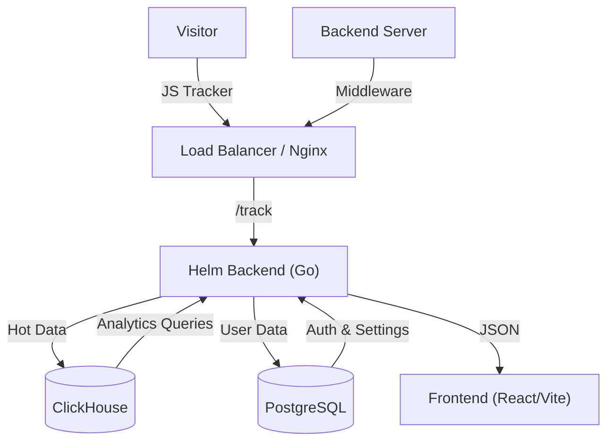

<div align="center">
  
  <h1>Helm Analytics</h1>
  <p><strong>The Website Intelligence Platform for the Post-Google Analytics Era.</strong></p>
  <p>Privacy-First Analytics • Server-Side Shield • Session Replay • Traffic Quality AI</p>

  <a href="https://github.com/Sentinel-Analytics/sentinel-mvp/actions"></a>
  <a href="https://github.com/Sentinel-Analytics/sentinel-mvp/releases"></a>
  <a href="https://pypi.org/project/helm-analytics/"></a>
  <a href="https://www.npmjs.com/package/helm-analytics"></a>
  <a href="https://github.com/sponsors/Sentinel-Analytics"></a>

  <br />
  <a href="#-architecture">Architecture</a> •
  <a href="#-installation--setup">Installation</a> •
  <a href="#%EF%B8%8F-configuration">Configuration</a> •
  <a href="#-sdk-integration">SDKs</a> •
  <a href="#-api-reference">API</a> •
  <a href="#-shield-active-defense">Shield Mode</a>
</div>

---

## 🧐 Why Helm?

Most analytics tools are passive observers. They tell you *what happened* yesterday. 
**Helm is an active participant.** It tells you what is happening *now*, and gives you the tools to intervene.

| Feature | Google Analytics 4 | Plausible | Helm Analytics |
| :--- | :--- | :--- | :--- |
| **Privacy** | ❌ Cookies & Tracking | ✅ GDPR Compliant | ✅ **GDPR Compliant** |
| **Blocking** | ❌ None | ❌ None | ✅ **Server-Side Shield** |
| **Replays** | ❌ None | ❌ None | ✅ **Session Reporting** |
| **Trust Score** | ❌ None | ❌ None | ✅ **Traffic Quality AI** |
| **Hosting** | ❌ SaaS Only | ✅ Self-Hostable | ✅ **Docker Native** |

---

## 🏗 Architecture

Helm is built for performance and scale. It uses a hybrid architecture to handle high-throughput event ingestion while providing real-time queries.



*   **Backend**: Written in **Go (Golang)** for sub-millisecond API response times.
*   **Analytics DB**: **ClickHouse** for columnar storage, enabling queries on millions of events in milliseconds.
*   **App DB**: **PostgreSQL** for user accounts, site settings, and firewall rules.
*   **Frontend**: **React + Vite + Tailwind** for a snappy, modern dashboard experience.

---

## 🚀 Installation & Setup

Helm is packaged as a multi-container Docker application. This is the **only** recommended way to run Helm in production.

### Prerequisites
*   Docker & Docker Compose (v2.0+)
*   Git
*   2GB RAM / 1 CPU (Minimum)

### Step 1: Clone the Repository
```bash
git clone https://github.com/Sentinel-Analytics/sentinel-mvp.git
cd sentinel-mvp
```

### Step 2: Configure Environment
Copy the example environment file (if available) or rely on defaults.
You typically only need to set the **JWT Secret** and **Database Passwords** for production.

### Step 3: Launch
```bash
docker-compose up -d
```
*   **Frontend**: http://localhost:5173
*   **Backend**: http://localhost:8080
*   **ClickHouse**: http://localhost:8123

### Step 4: Create Admin Account
Open the dashboard at `http://localhost:5173`. The first user you register will automatically be the instance admin.

---

## ⚙️ Configuration

Helm can be customized using environment variables passed to the `backend` container.

### Backend Variables

| Variable | Description | Default | Required for Prod? |
| :--- | :--- | :--- | :--- |
| `PORT` | API Listening Port | `8080` | No |
| `ENV` | Environment (`dev` or `prod`) | `dev` | **Yes** |
| `DATABASE_URL` | Postgres Connection String | `postgres://...` | **Yes** |
| `CLICKHOUSE_HOST` | ClickHouse TCP Address | `clickhouse:9000` | **Yes** |
| `JWT_SECRET` | Secret key for session signing | `ChangeMe...` | **CRITICAL** |
| `ALLOW_ORIGINS` | CORS Allowed Origins (Comma Sep) | `http://localhost:5173` | **Yes** |
| `GEMINI_API_KEY` | Key for AI Insights | *(Empty)* | Optional |
| `HELM_PRO_KEY` | License Key for Pro Features | *(Empty)* | Optional |

### Database Variables
Manage these in `docker-compose.yml` under the `postgres` and `clickhouse` services.
*   `POSTGRES_PASSWORD`: Set a strong password.
*   `CLICKHOUSE_PASSWORD`: Set a strong password (update `CLICKHOUSE_HOST` accordingly).

---

## 🌐 Client-Side Integration

To track standard page views and sessions, add the tracking script to your website's `<head>`.

1.  **Get your Snippet**:
    *   Log in to your Helm Dashboard.
    *   Go to **Settings** -> **Tracking Code**.
    *   Copy the snippet.

2.  **Add to HTML**:
    ```html
    <!-- Helm Analytics -->
    <script async defer src="https://analytics.yourdomain.com/tracker.js" data-website-id="YOUR_SITE_UUID"></script>
    ```

That's it! Helm will automatically track:
*   Page Views
*   Unique Visitors
*   Referrers
*   Device/OS/Browser
*   Screen Size

---

## 🔌 SDK Integration

Helm Middleware SDKs allow you to track server-side events and enable **Shield Mode**.

### 🐍 Python (Flask, FastAPI, Django)
**Installation**: `pip install helm_analytics`

**FastAPI Example:**
```python
from fastapi import FastAPI
from helm_analytics import HelmAnalytics

app = FastAPI()
helm = HelmAnalytics(
    site_id="YOUR_SITE_ID", 
    api_url="http://localhost:8080" # Point to your self-hosted instance
)

# Enable Shield (Blocking) Mode
app.add_middleware(BaseHTTPMiddleware, dispatch=helm.fastapi_dispatch(shield=True))
```

### 🟢 Node.js (Express)
**Installation**: `npm install helm-analytics`

**Express Example:**
```javascript
const express = require('express');
const HelmAnalytics = require('helm-analytics');

const app = express();
const helm = new HelmAnalytics({
    siteId: 'YOUR_SITE_ID',
    apiUrl: 'http://localhost:8080'
});

// Enable Shield (Blocking) Mode
app.use(helm.middleware({ shield: true }));
```

### 🐹 Go (Golang)
*Coming Soon - Development in progress.*

---

## 🛡 Shield (Active Defense)

**Shield Mode** turns Helm from a passive tracker into an active firewall.

1.  **How it works**: When a request hits your middleware (SDK), it sends metadata (IP, UA, ASN) to the Helm Backend.
2.  **Decision**: Helm checks your Firewall Rules + Traffic Quality AI.
3.  **Action**: If malicious, Helm returns a `403 Forbidden` signal. The SDK kills the request immediately.
4.  **Result**: The bad bot never touches your database or expensive API logic.

**Capabilities:**
*   **IP Ban**: Block specific IPs or CIDR ranges.
*   **Country Ban**: Block entire countries (GeoIP).
*   **ASN Ban**: Block specific hosting providers (e.g., AWS, DigitalOcean) if your users are consumers.
*   **AI Blocking**: (Experimental) Block based on behavioral trust scores.

---

## 📡 API Reference

You can interact with Helm directly via HTTP API.

### `POST /track`
Send an analytics event.
```json
{
  "siteId": "uuid",
  "eventType": "pageview",
  "url": "https://mysite.com",
  "userAgent": "Mozilla/5.0...",
  "clientIp": "1.2.3.4"
}
```

### `GET /api/sites`
List all websites you are tracking.
*   **Headers**: `Authorization: Bearer <token>`

### `POST /api/shield/decision`
Check if a request should be allowed.
```json
{
  "siteId": "uuid",
  "ip": "1.2.3.4",
  "userAgent": "Bot/1.0",
  "url": "https://mysite.com"
}
```
**Response**: `{"action": "allow"}` or `{"action": "block", "reason": "ip_ban"}`

---

## 🛠 Troubleshooting

**1. "Connection Refused" to ClickHouse**
*   Ensure the `clickhouse` container is healthy: `docker ps`.
*   Check logs: `docker logs sentinel-clickhouse-1`.
*   Verify `CLICKHOUSE_HOST` in backend matches container name.

**2. CORS Errors in Dashboard**
*   Update `ALLOW_ORIGINS` in backend environment variables to include your production domain.
*   Example: `ALLOW_ORIGINS=https://dashboard.mydomain.com`.

**3. "Shield Mode" Latency**
*   Shield Mode adds a network round-trip. Ensure your App server is close to your Helm Backend (same region recommended).
*   Typical overhead: 10-20ms within same datacenter.

---

## 💖 Sponsorship & Community

Helm is "Open Core" software. The core analytics are free forever.
Advanced features (AI Insights, Organization Management) are supported by our sponsors.

*   [**GitHub Sponsors**](https://github.com/sponsors/Sentinel-Analytics): Support development.
*   **Enterprise Support**: Contact `sales@sentinel.com` (Placeholder) for managed contracts.

## 📄 License

Helm Analytics is licensed under the **Elastic License 2.0 (ELv2)**.

*   ✅ **You can:** Use, copy, modify, and distribute the software.
*   ✅ **You can:** Use it internally for your business.
*   ❌ **You cannot:** Provide the software to others as a managed service (SaaS).
*   ❌ **You cannot:** Circumvent the license key checks.

See [LICENSE](LICENSE) for full details.
