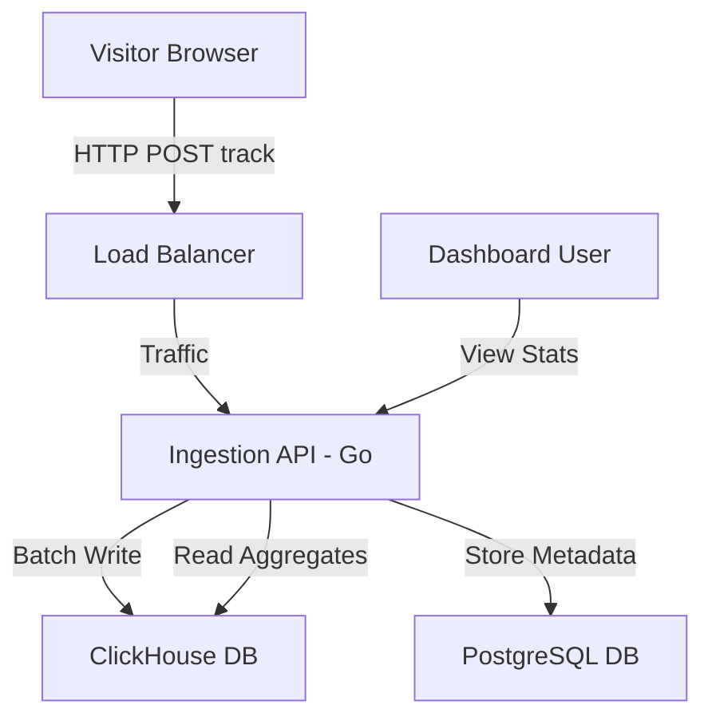

# Helm Analytics

<div align="center">
  
</div>

<div align="center">

**The High-Performance, Privacy-First Web Analytics Platform.**

[](LICENSE)
[](https://github.com/orgs/Helm-Analytics/packages?repo_name=helm-analytics)

[Live Demo](https://helm-analytics.com/demo) · [Documentation](https://helm-analytics.com/docs) · [Follow us on X](https://x.com/helm_analytics)

</div>

---

## Introduction

Helm Analytics is a self-hosted, open-source alternative to traditional analytics platforms, engineered for speed, privacy, and absolute data ownership.

Unlike older analytics tools that bloat websites with heavy tracking scripts and monetize user data, Helm Analytics utilizes a lightweight tracker (< 2KB) and stores all telemetry on your own infrastructure. The core engine leverages ClickHouse (Columnar Database) and Go to achieve sub-second query performance across massive, high-volume datasets.

## Core Features

### Web Analytics & Telemetry
- **Real-Time Traffic Monitoring:** View concurrent active visitors on your platform with zero latency.
- **Privacy-Centric Tracking:** Perform unique visitor attribution without relying on persistent cookies or IP logging.
- **Geospatial & Device Data:** Comprehensive breakdowns by Browser, Operating System, Country, and City.
- **UTM Campaign Tracking:** Automatic attribution and grouping for marketing campaigns.

### Session Intelligence
- **High-Fidelity Session Replay:** Record and watch user sessions to identify UX friction points. Privacy controls allow automatic masking of sensitive text inputs.
- **Heatmaps:** Generate precise visual overlays of click and scroll data to optimize page layouts.
- **Conversion Funnels:** Construct multi-step user journey paths to pinpoint drop-off rates.

### Application Security & Performance
- **High-Throughput Ingestion:** Go-based API handles thousands of tracking events per second silently and securely.
- **Rate Limiting:** IP-based rate limiting to mitigate abuse and protect ingestion endpoints.

---

## Architecture

Helm Analytics is designed from the ground up for horizontal scalability and high throughput.


- **Ingestion API (Go):** Capable of handling thousands of requests per second with a minimal CPU footprint.
- **Storage (ClickHouse):** Highly optimized analytical database for rapid OLAP querying.
- **Metadata (PostgreSQL):** Relational storage for user accounts, domain configurations, and settings.
- **Frontend (React/Vite):** A responsive, fast loading Single Page Application (SPA).

---

## Getting Started

### 1. Installation script

The recommended way to deploy Helm Analytics in a production environment is using the automated installation script. 

Run the following command on a fresh Ubuntu 20.04+ or Debian VPS:

```bash
curl -sSL https://helm-analytics.com/install.sh | bash
```

This script will install Docker, pull the required images, configure the local environment, and start the Helm Analytics platform.

### 2. Manual Installation (Alternative)

If you prefer to manage your own reverse proxy infrastructure, you can deploy the stack manually.

```bash
curl -o docker-compose.yml https://raw.githubusercontent.com/Helm-Analytics/helm-analytics/master/docker-compose.yml
docker compose up -d
```

### 3. Configure SSL (Caddy)

If you use the automated script and choose to enable SSL, Caddy will automatically provision a Let's Encrypt certificate.
Ensure ports `80` and `443` are open on your firewall and point your DNS A Record to your server's IP address beforehand.

### 4. Application Setup

After the containers are running, navigate to your domain (or `http://<your-server-ip>:8012` if running locally without SSL).

1. Register an administrator account. The first account created assumes the Admin role.
2. Navigate to the "Websites" section and click "Add Site".
3. Enter your target domain name.
4. The system will generate a lightweight JavaScript tracking snippet.
5. Copy and paste this snippet into the `<head>` section of your website.

---

## SDK Integration

Helm Analytics offers high-performance server-side SDKs for developers who wish to integrate tracking directly into their application backend logic.

Configure your SDKs via Environment Variables for zero-code configuration:
- `HELM_SITE_ID`: Your unique site identifier (found in the dashboard).
- `HELM_API_URL`: Your self-hosted Helm Analytics URL (e.g., `https://analytics.your-domain.com`).

### Go SDK

```go
import "github.com/helm-analytics/helm-go"

h := helm.New(helm.Config{})

func handler(w http.ResponseWriter, r *http.Request) {
    if !h.Track(r, "pageview", nil, true) {
        return // Blocked by firewall
    }
}
```

### Python SDK

```python
from helm_analytics import HelmAnalytics

helm = HelmAnalytics()
helm.track(request, page_title="Checkout", lcp=1.2)
```

### Node.js SDK

```javascript
const HelmAnalytics = require('helm-analytics');
const helm = new HelmAnalytics();

await helm.track(req, 'pageview', { 
  options: { pageTitle: 'Pricing' } 
});
```

---

## Support & Community

We actively monitor our community channels and provide assistance for self-hosted instances. 

We don't have a Discord server yet, but we'd love for you to follow along with our journey:

- **Follow us on X (Twitter):** [@helm_analytics](https://x.com/helm_analytics)
- **Direct Support:** [support@helm-analytics.com](mailto:support@helm-analytics.com)

---

## Contributing

We welcome code contributions, bug reports, and feature requests. 

1. Fork the repository.
2. Create your feature branch (`git checkout -b feature/Optimization`).
3. Commit your changes.
4. Push to the branch (`git push origin feature/Optimization`).
5. Open a Pull Request.

Please read our `CONTRIBUTING.md` guidelines before making large structural changes.

## License

Helm Analytics is strictly distributed under the terms of the **AGPL 3.0 License**. 

By using, modifying, or distributing this software, you agree to the conditions outlined in the `LICENSE` file. This ensures that any modifications made to the core platform must be contributed back to the open-source community.
